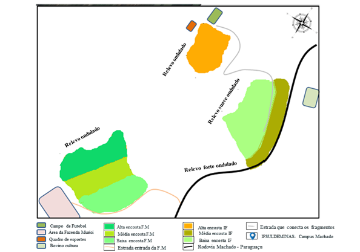
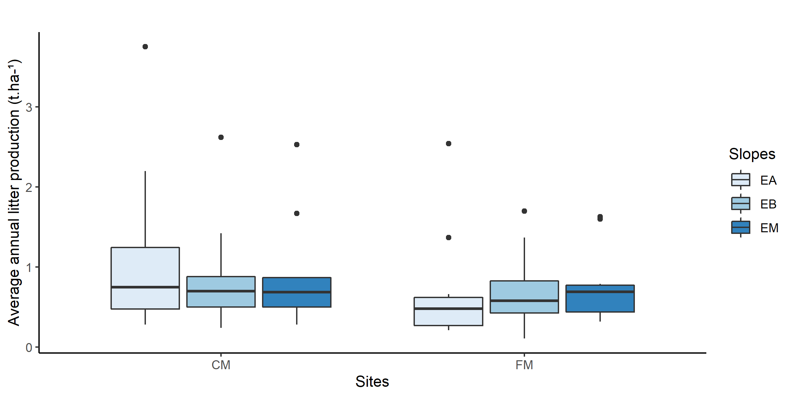
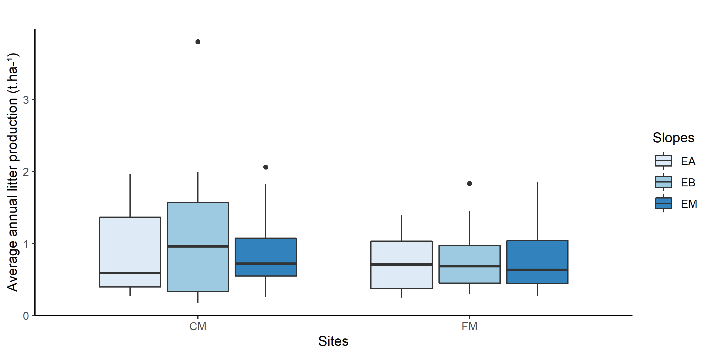

```{r setup, include=FALSE}
knitr::opts_chunk$set(echo = TRUE)
```


**1. Introdução**
  
  O conhecimento das taxas de deposição e da transformação da serapilheira tem sido considerado relevante para estudos de diagnóstico ambiental e da intensidade de impactos naturais e antrópicos, permitindo a comparação entre diferentes sistemas por meio de parâmetros quantitativos de seu funcionamento (@Cianciaruso2006). Conforma (@Sales2017) a serapilheira é a camada superficial presente no solo de ecossistemas florestais composta por folhas, galhos, órgãos reprodutivos e outros fragmentos vegetais/animais em vários estágios de decomposição. De acordo com (@Paudel2015) a serapilheira apresenta um papel fundamental no processo de ciclagem de nutrientes e também na manutenção do solo dos ecossistemas terrestres.
  Esses processos podem variar em função de vários fatores bióticos e abióticos tais como: o ambiente físico (luminosidade, umidade, temperatura, altitude, precipitação, tipo de vegetação), a longevidade das folhas, herbivoria e o grau de perturbação do ecossistema (@Edwards2018). 


**2. Objetivos**

  Esse trabalho foi desenvolvido com objetivo de avaliar a produção e a composição da serapilheira em dois fragmentos de Floresta Estacional Semidecídua situados em diferentes posições de relevo.

**3. Métodos**


*3.1 Área de estudo*

  A pesquisa foi desenvolvida durante o período de agosto de 2016 a julho de 2018 em fragmentos florestais situados no Instituto Federal do Sul de Minas Gerais (IFSULDEMINAS) - Campus Machado e na Fazenda Murici, confrontante do IFSULDEMINAS - Campus Machado (Figura 1).

 

Figura 1 - Localização dos fragmentos florestais do presente estudo com a classificação do relevo.
  
  
*3.2 Análise estatística* 

  Os resultados de deposição da serapilheira foram comparados entre as diferentes posições de relevo (baixa, média e alta encosta) nas duas áreas: Campus Machado e Fazenda Murici. Para tanto foi realizado o teste Shapiro-Wilkis para analisar a normalidade dos dados, já que os dados não apresentam normalidade, para comparar os tratamentos  foi utilizado o teste não paramétrico  de Kruskal-Wallis.
	
**3. Resultados**

  Considerando a produção de serapilheira dos fragmentos situados no Campus Machado durante o primeiro ano a Encosta Alta apresentou maior distribuição dos dados e maior pico de deposição de serapilheira  (3.75 t.ha-1), as encostas baixa e média apresentam distribuições similares. Nos fragmentos situados na área da Fazenda Murici o maior pico de produção de serapilheira foi na Encosta Alta (2.54 t.ha-1), porém a Encosta Baixa apresentou maior distribuição dos dados (Figura 2).
  
  

Figura 2-Boxplot referente a produção anual média de serapilheira no período de 2016 à 2017 nos dois fragmentos estudados e em suas respectivas posições de relevo, onde CM= Campus Machado, FM= Fazenda Murici; EA= Encosta alta, EB= Encosta baixa e EM= Encosta média. 



Figura 3-Boxplot referente a produção anual média de serapilheira no período de 2017 à 2018 nos dois fragmentos estudados e em suas respectivas posições de relevo, onde CM= Campus Machado, FM= Fazenda Murici e EA= Encosta alta, EB= Encosta baixa e EM= Encosta média.


  No período de 2017 à 2018 a produção de serapilheira dos fragmentos situados no Campus Machado a Encosta Baixa apresentou maior distribuição dos dados e maior pico de  deposição de serapilheira  (3.80 t.ha-1). Já os fragmentos da Fazenda Murici todas as encostas apresentaram distribuição dos dados similares, sendo que o maior pico de produção (1.83 t.ha-1) foi na Encosta Baixa (Figura 2)

  Portanto, quando se analisa os dados verifica-se que não há diferença significativa entre as posições de relevo estudadas nas duas áreas. Esses resultados podem estar relacionados a com a composição das frações da serapilhera (material vegetativo e reprodutivo). Além disso, os aspectos das comunidades florestais estudadas também pode influenciar a deposição de serapilheira, como por exemplo, estrutura horizontal (densidade de árvores, área basal) e a aspectos florísticos, como composição, tipos funcionais e categorias sucessionais das espécies arbóreas encontradas nas diferentes porções do relevo. 
  
 
  
 ```{r echo=FALSE}
 
  dados <- read.table("../data/dados_primeiro ano.txt",header = T)
  fz1 <- subset(dados,x=="FM")
  shapiro.test(fz1$y)
 
 kruskal.test(data=fz1,y~Slopes)
 
 cm1 <- subset(dados,x=="CM")
 shapiro.test(cm1$y)
 
 kruskal.test(data=cm1,y~Slopes)
 
 dados <- read.table("../data/dados_segundo ano.txt",header = T)
 fz2 <- subset(dados,x=="FM")
 shapiro.test(fz2$y)
 
 kruskal.test(data=fz2,y~Slopes)
 
 cm2 <- subset(dados,x=="CM")
 shapiro.test(cm2$y)
 
 kruskal.test(data=cm2,y~Slopes)
 
 ```
 **Referências**
 
 
 
 
 
 
 
